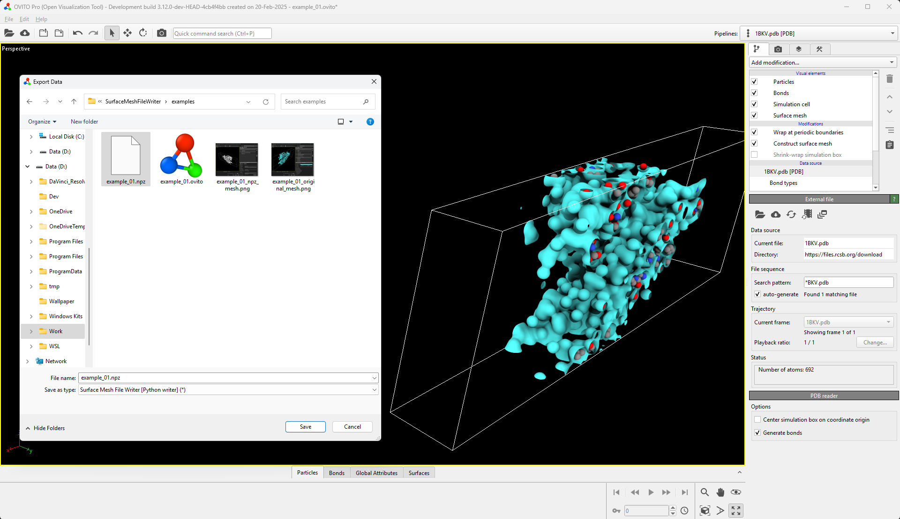
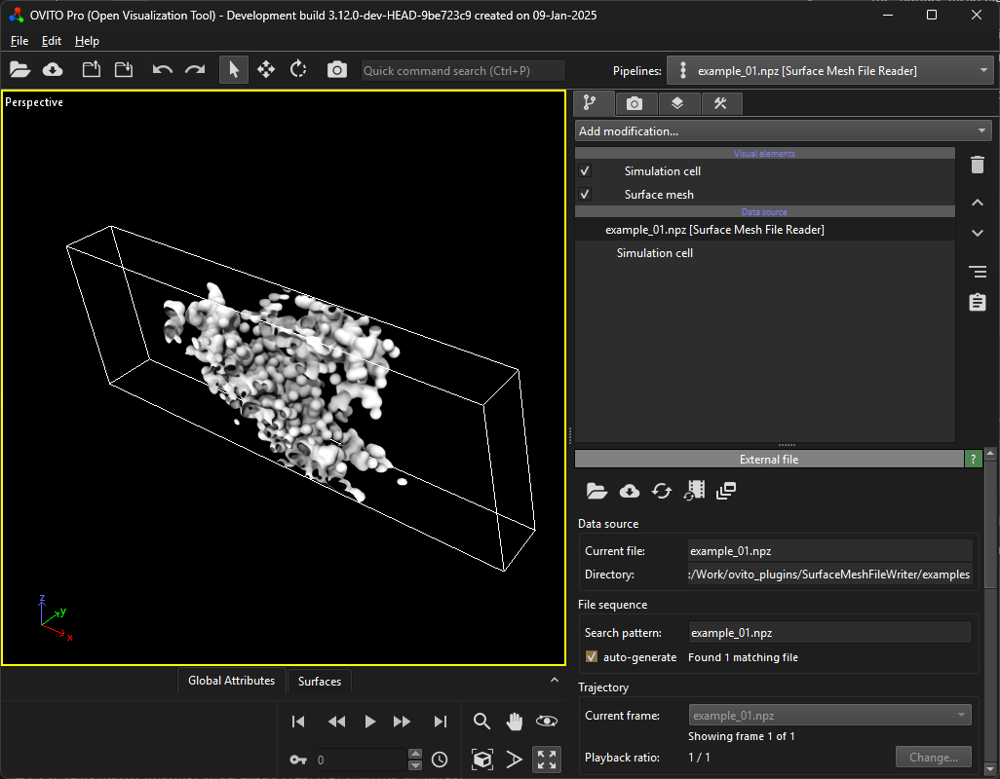

# SurfaceMeshIO
OVITO extension to read/write [surface meshes](https://www.ovito.org/manual/python/introduction/data_model.html#surface-meshes) with all attached properties from/to a [compressed numpy file](https://numpy.org/doc/2.1/reference/generated/numpy.savez_compressed.html#numpy.savez_compressed). 

The configuration of the visual element is not exported.

## Example
The surface mesh created in ``examples/example_01.ovito`` can be exported using the [export file dialog](https://www.ovito.org/manual/python/introduction/data_model.html#surface-meshes) selecting the "Surface mesh file writer" format.



The resulting ``.npz`` file matches ``examples/example_01.npz``. This file can be opened in OVITO Pro GUI. This reconstructs the surface mesh with all its properties.



Both import and export are also available from Python:

```Python
from ovito.io import import_file, export_file

# import npz file
pipeline = import_file("examples/example_01.npz")

from SurfaceMeshIO import SurfaceMeshFileWriter

# export npz file
export_file(data, "examples/example_01.npz", format=SurfaceMeshFileWriter, key=data.surfaces["surface"])
```

## Installation
- OVITO Pro [integrated Python interpreter](https://docs.ovito.org/python/introduction/installation.html#ovito-pro-integrated-interpreter):
  ```
  ovitos -m pip install --user git+https://github.com/nnn911/SurfaceMeshIO.git
  ``` 
  The `--user` option is recommended and [installs the package in the user's site directory](https://pip.pypa.io/en/stable/user_guide/#user-installs).

- Other Python interpreters or Conda environments:
  ```
  pip install git+https://github.com/nnn911/SurfaceMeshIO.git
  ```

## Technical information / dependencies
- Tested on OVITO version 3.12.0

## Contact
Daniel Utt (utt@ovito.org)
